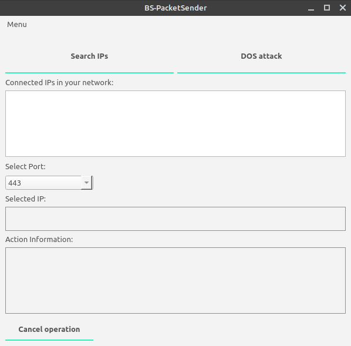

# PacketSender

<p>
  
  
  
  
  
  

  
  
  
</p>

PacketSender is a PyQt5 program that generates a lot of network packets and flood a network with so much traffic that it cannot operate or communicate as it normally.

## Usage


```bash
python main.py
```
You can use pyinstaller module to make it a single package(*exe):
```bash
pip install pyinstaller
```
In the app directory open terminal and type.
```
pyinstaller --onefile --windowed main.py
```
You can customize the .spec file to change app name.

## requirements 
install pyqt5\
install nmap\
install python-nmap module

## Disclaimer

- This project was created for educational purposes and should not be used in environments without legal authorization.

## Contributing
Pull requests are welcome. For major changes, please open an issue first to discuss what you would like to change.
## License
[MIT](https://choosealicense.com/licenses/mit/)
